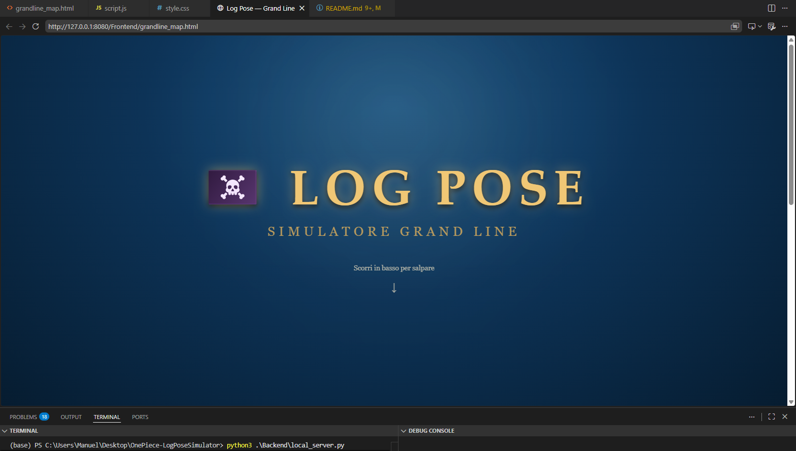
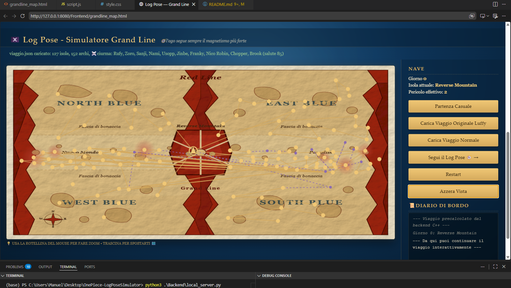
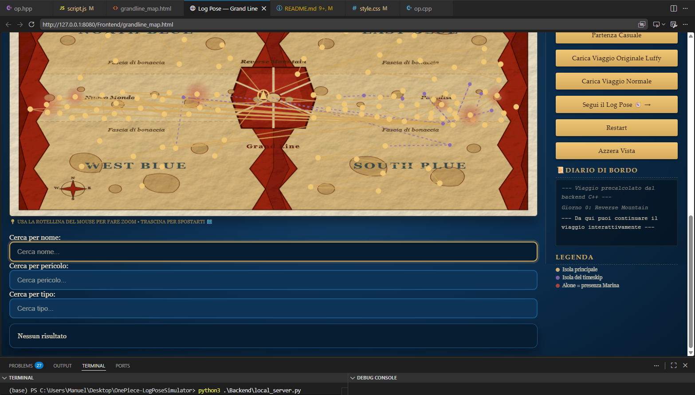

# Simulatore Log Pose e mappa One Piece
# Preview

---

---

---

---

Ho creato una simulazione personale del funzionamento del Log Pose usato in One Piece dalle ciurme per sapere la rotta per la prossima isola. Ho creato anche una sorta di mappa rappresentativa del mondo di One Piece e situato le isole e tutte le info in modo soggettivo, esplorabile.

# How To Compile
**Requirements: compilatore python e cpp**
**1.** Dentro alla directory Backend: compila op.cpp,op.hpp,main.cpp,json.hpp,grandline.json: g++ -std=c++17 main.cpp op.cpp -o ../bin/simulatore
**2.** Lancia simulatore dentro alla directory  bin e si creerà viaggio.json
**3.** Lancia il server con: python3 ./Backend/local_server.py

> Per modificare la mappa, basta modificare lo script image_svg_generator.py e lanciarlo sempre con python3, così crea in automatico un nuovo file.svg

---

# How To Contribute
**Per qualsiasi cosa, bug, aggiunta, consigli, ecc... (vedi anche le sezioni su github Issues o Discussions).**

**Per modifiche:**
- Fai un fork, clonalo in locale, modifica il codice, vai alla seziona sopra "How To Compile" per compilarlo e testarlo e infine apri una Pull Request. 

**Aggiunte da fare:** 
    **1.** Aggiungere una nuova variabile di tipo string o vettore di string nella struttura dati Isola, chiamata citazioni_iconiche, dove appunto rappresenta la/e citazione/i iconica/he fatte in un arco di quell'isola da un determinato personaggio.
    **2.** Aggiungere gli archi narrativi. 
    **3.** Aggiungere i personaggi coinvolti nell'isola e nell'arco narrativo.
    **4.** Aggiungere per ogni isola i regni/villaggi/paesi interni ad essa.
    **5.** Completare tutti i reparti e scrivere il livello di pericolo giusto.
    **6.** In  `isola_dettagli.html` non rimettere quello che già c'è adesso, ma mettere un approfondimento testuale dell'isola, un vero e proprio testo descrittivo.

---

# Structure

## General
Il progetto è organizzato in modo modulare e suddiviso in quattro blocchi principali. Il backend in C++ è responsabile della costruzione del grafo del mondo di One Piece, delle relazioni tra le isole e della generazione dei file JSON utilizzati successivamente dal frontend. Il backend in Python invece fornisce un piccolo server locale che espone i dati in modo semplice e accessibile. Il dataset contiene i file JSON con le informazioni sulle isole, sulle rotte, sui pesi dei collegamenti e sulle coordinate geometriche usate per rappresentare la mappa. Il frontend, composto da file HTML, CSS e JavaScript, si occupa di mostrare la mappa, permettere l’esplorazione delle isole e visualizzare i dettagli relativi ai percorsi e alle informazioni associate.

Il flusso operativo è il seguente: il programma C++ legge il dataset, costruisce la struttura logica del mondo e genera il file di output che rappresenta il viaggio simulato; il server Python serve questi dati localmente; il frontend li legge e li rende visibili all’utente tramite l’interfaccia web. Inoltre, la cartella Images contiene le immagini e gli asset grafici utilizzati per la presentazione del progetto, mentre la cartella bin raccoglie l’eseguibile compilato e i file generati durante l’esecuzione.

---

## Note sul Grafo in cpp
grafo principale diretto, pesato, sparso, semplice, con etichette su nodi e archi, ed embedding geometrico esplicito.

* **Ciclico**: archi come 9→10 e ritorni 10→9, oppure l'hub Sabaody (10) che va e torna dalle 9 isole del timeskip. Un cammino può tornare su un nodo già visitato.

* **Sparso**:Un grafo è "denso" quando il numero di archi si avvicina a n² (quasi ogni nodo collegato a quasi ogni altro); avendo:
circa 30 nodi (isole)
circa 50 archi
Con 30 nodi, un grafo denso avrebbe centinaia di archi (30×29 circa 870 nel caso diretto completo).Ho una minima parte - ogni isola è connessa solo a 1-3 vicine, non a tutte. Questo è sparso: il Log Pose non ti fa scegliere tra 20 isole, solo tra quelle raggiungibili dal punto in cui sei.
se fosse denso useresti una matrice di adiacenza, se fosse undirected dovresti gestire la simmetria degli archi da qualche parte, invece qua posso usare una lista di adiacenza.

* **Diretto**: ho {"da": 4, "a": 5, "giorni": 2} E separatamente {"da": 5, "a": 4, "giorni": 1} - due archi distinti con pesi diversi (2 giorni andata, 1 giorno ritorno). Se fosse undirected, un solo arco basterebbe e rappresenterebbe automaticamente entrambe le direzioni con lo stesso peso. Il fatto che tu debba scrivere esplicitamente sia da:4,a:5 che da:5,a:4 con pesi indipendenti è la prova che il grafo è diretto - semplicemente capita che molte coppie di nodi abbiano archi in entrambe le direzioni (ma non è obbligatorio, es. magari alcune rotte sono a senso unico).

* **Semplice**: un multigrafo (non-simple) avrebbe più archi paralleli nella stessa direzione tra la stessa coppia di nodi (es. due modi diversi di andare da Jaya a Skypiea, entrambi rappresentati come archi separati 4->5). Nel JSON attuale non c'è questo caso: ogni coppia ordinata (da, a) appare una sola volta. È simple, a meno che in futuro tu voglia aggiungere ad esempio due rotte alternative tra le stesse isole (una sicura più lunga, una pericolosa più corta) - lì sì diventerebbe un multigrafo.

* **Weighted**: giorni, pericolo, magnetismo come pesi sugli archi.

* **Embedded**:  x, y per ogni isola: il grafo ha un'immersione geometrica nel piano, non è solo topologia astratta.

* **Explicit**: rappresento gli archi esplicitamente in adiacenze (adjacency list), non li calcoli implicitamente da una regola.

* **Labeled**: sia nodi (nome, tipo, pericolo) che archi (giorni, magnetismo) portano etichette/attributi oltre alla pura connettività.

